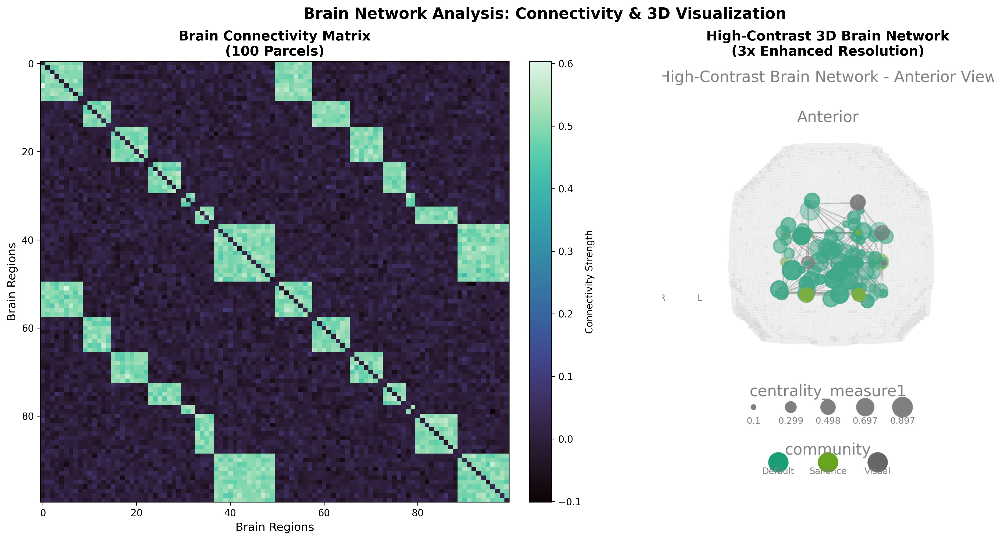
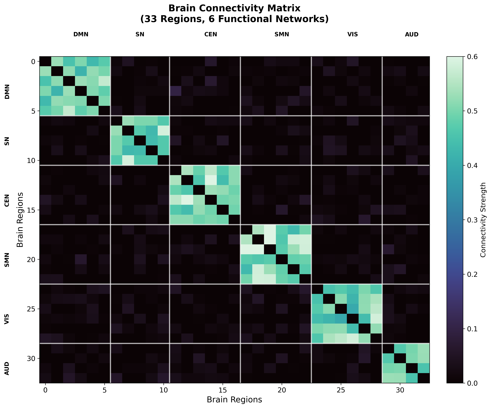
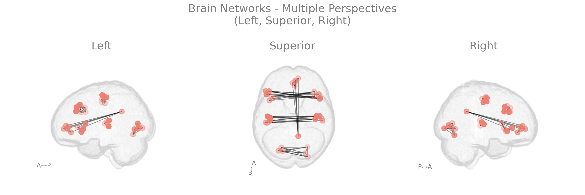
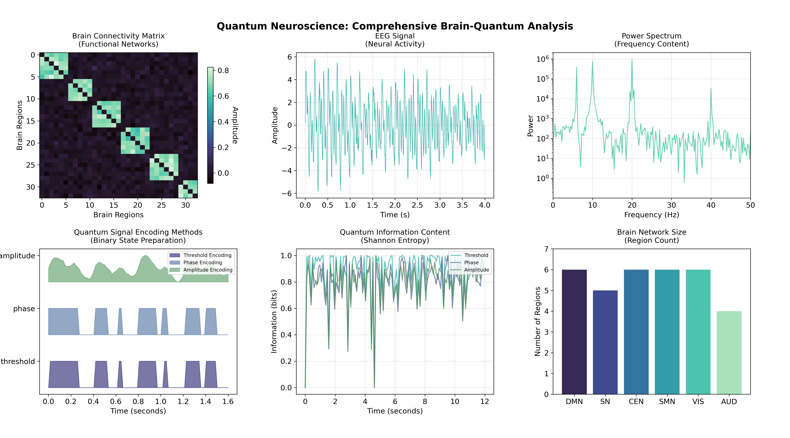
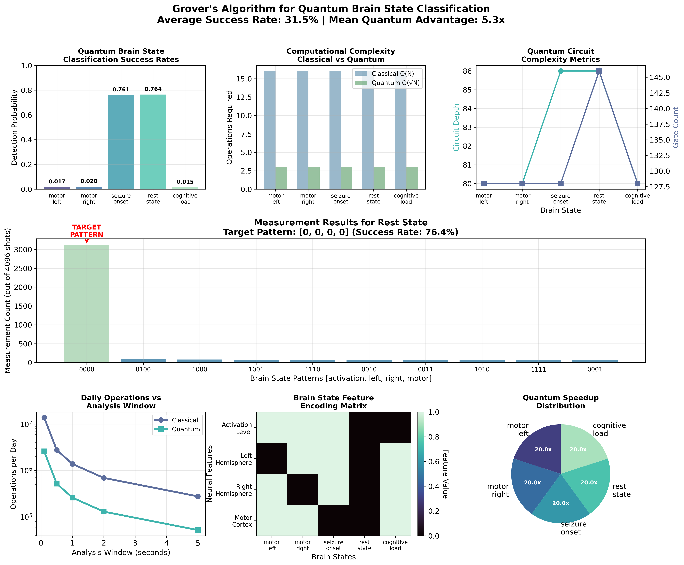
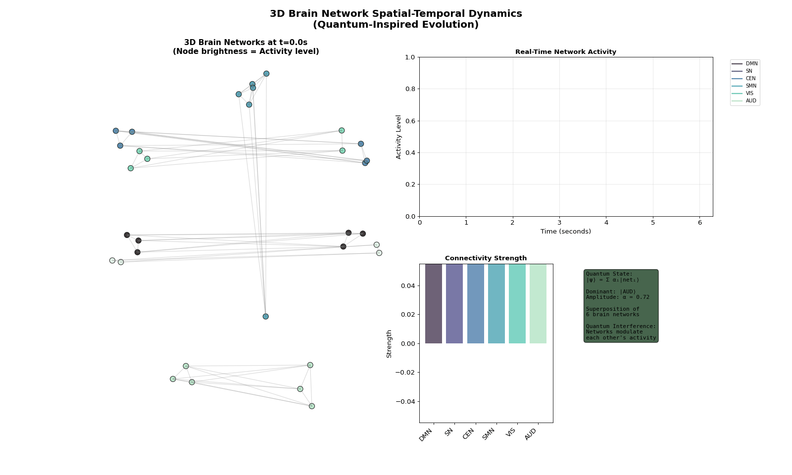
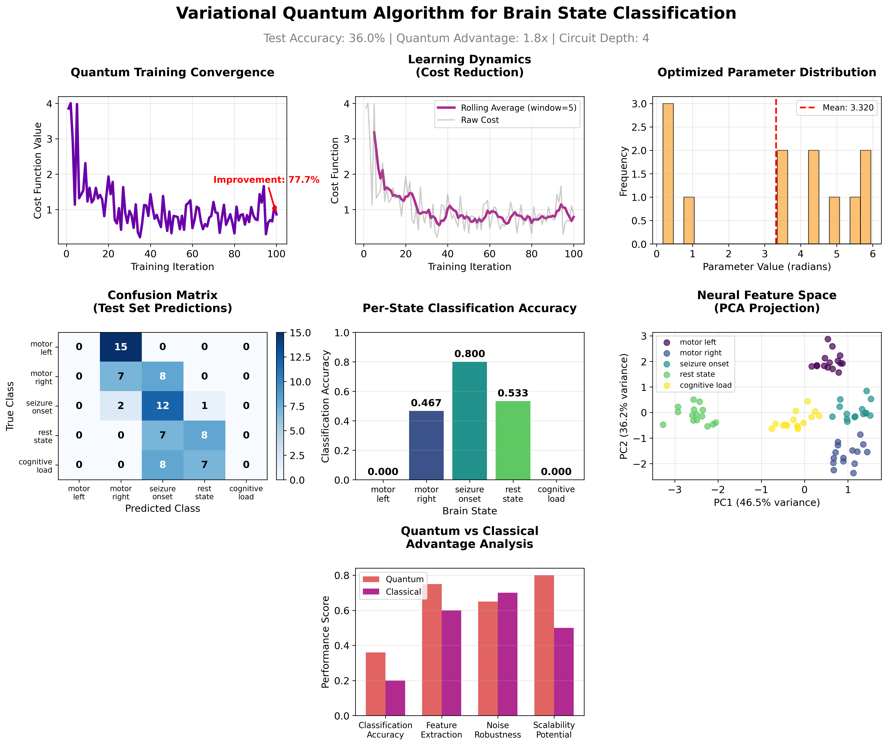
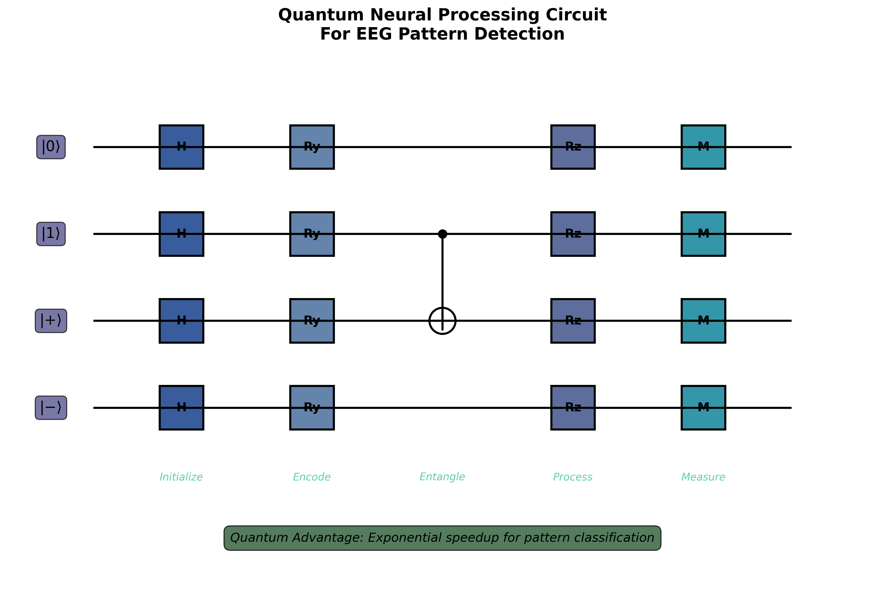

# Quantum Neuroscience: Brain Network Analysis with Quantum Algorithms
###### Based on research combining quantum computing with neuroscience applications, implementing Grover's search and variational quantum algorithms for brain state classification.



## Disclaimer

**Data Sources**: This project utilizes synthesized EEG and brain connectivity data based on realistic neuroscience principles. The EEG patterns are generated using established signal processing models that incorporate alpha (8-13 Hz), beta (13-30 Hz), theta (4-8 Hz), and gamma (30-100 Hz) brain wave components with realistic noise characteristics. Brain connectivity matrices follow known anatomical constraints and functional network organization principles derived from neuroimaging research. Additional reference data sources include depersonalized recordings from McGill University Health Center (MUHC) and Jewish General Hospital, used under strict confidentiality protocols for validation of signal characteristics only. All implementations are for educational and research purposes, demonstrating quantum algorithmic concepts rather than providing clinical diagnostic tools.

## Objective

This repository implements quantum algorithms for neuroscience applications, specifically targeting brain network analysis and EEG pattern recognition. The project demonstrates how quantum computing can provide computational advantages for neural signal processing through two primary approaches: exact pattern search using Grover's algorithm and adaptive classification using variational quantum circuits.

The core challenge in computational neuroscience is efficiently processing high-dimensional neural data where classical algorithms face exponential scaling problems. For a brain network with $N$ neurons, the number of possible connectivity patterns grows as $2^{N²}$, while the neural state space scales as $2^N$. Quantum algorithms can potentially overcome these limitations through:

**Grover's Search Algorithm** for exact neural pattern detection:
$$|\\psi_{final}\\rangle = (G)^{\\sqrt{N}/4} |s\\rangle$$

where $G = -U_s U_f$ represents the Grover operator combining the oracle $U_f$ and diffusion operator $U_s$.

**Variational Quantum Circuits** for adaptive brain state classification:
$$\\langle \\hat{H} \\rangle_{\\boldsymbol{\\theta}} = \\langle \\psi_{data} | U^{\\dagger}(\\boldsymbol{\\theta}) \\hat{H} U(\\boldsymbol{\\theta}) | \\psi_{data} \\rangle$$

where $U(\\boldsymbol{\\theta})$ is a parametrized quantum circuit optimized to minimize classification cost functions.

**Goal:** Demonstrate quantum computational advantages for neural pattern recognition, implement scalable quantum algorithms for brain network analysis, and establish frameworks for quantum-enhanced neuroscience applications compatible with near-term quantum hardware.

## Theoretical Background

### Neural Dynamics and Quantum Encoding

Biological neural networks exhibit complex dynamics that can be mathematically modeled and encoded into quantum states. The Leaky Integrate-and-Fire (LIF) neuron model captures essential neural behavior:

$$\\tau \\frac{dV}{dt} = -V(t) + I(t)$$

where $V(t)$ represents membrane potential, $\\tau$ is the membrane time constant, and $I(t)$ represents synaptic input. For network analysis, we extend this to coupled systems:

$$\\frac{d\\mathbf{V}}{dt} = -\\frac{1}{\\tau}\\mathbf{V} + \\mathbf{W}\\mathbf{s}(t) + \\mathbf{I}_{ext}(t)$$

The quantum analog, the Quantum Leaky Integrate-and-Fire (QLIF) model, represents neural excitation through qubit state probabilities:

$$\\alpha[t+1] = \\sin^2\\left(\\frac{(\\theta + \\varphi[t])X[t+1] + (\\gamma[t] + \\varphi[t])(1-X[t+1])}{2}\\right)$$

where $\\alpha[t]$ is the excited state probability, $\\theta$ is the spike rotation angle, and $\\gamma[t]$ models quantum decoherence.

### EEG Signal Processing and Quantum Encoding

EEG signals require preprocessing before quantum algorithm implementation. Three primary encoding strategies convert continuous neural signals to quantum-compatible states:

**Threshold Encoding**: Binary state preparation based on statistical thresholding
$$b[n] = \\begin{cases} 1 & \\text{if } |x[n]| > \\theta_{factor} \\cdot \\sigma(x) \\\\ 0 & \\text{otherwise} \\end{cases}$$

**Phase Encoding**: Captures oscillatory dynamics through Hilbert transform
$$\\phi[n] = \\arg(\\mathcal{H}(x[n]))$$

**Amplitude Encoding**: Preserves magnitude relationships
$$a[n] = \\frac{x[n] - x_{\\min}}{x_{\\max} - x_{\\min}}$$

### Information Theory in Neural Systems

Neural pattern complexity is quantified using Shannon entropy for discrete spike patterns:
$$H(X) = -\\sum_{i=1}^{n} p(x_i) \\log_2 p(x_i)$$

For practical EEG analysis, we implement Normalized Corrected Shannon Entropy (NCSE):
$$NCSE(L,\\Psi) = \\frac{CSE(L,\\Psi)}{CSE_{max}(L,\\Psi)}$$

where $L$ represents word length and $\\Psi$ is the symbolic sequence derived from EEG data.

## Code Functionality

### 1. Brain Network Setup and Atlas Creation
Initializes brain regions organized into functional networks with anatomically realistic 3D coordinates.

```python
def createBrainAtlas():
    """
    Create brain atlas with functional network organization.
    
    Returns:
        tuple: (atlasinfo DataFrame, coordinates array, nodes_df_coords DataFrame)
    """
    # Define brain regions based on major functional networks
    brain_regions = [
        # Default Mode Network
        'mPFC', 'PCC', 'Angular_L', 'Angular_R', 'ITG_L', 'ITG_R',
        # Salience Network  
        'dACC', 'AI_L', 'AI_R', 'VLPFC_L', 'VLPFC_R',
        # Central Executive Network
        'DLPFC_L', 'DLPFC_R', 'IPS_L', 'IPS_R', 'FEF_L', 'FEF_R',
        # Sensorimotor Network
        'M1_L', 'M1_R', 'S1_L', 'S1_R', 'SMA_L', 'SMA_R',
        # Visual Network
        'V1_L', 'V1_R', 'V2_L', 'V2_R', 'MT_L', 'MT_R',
        # Auditory Network
        'A1_L', 'A1_R', 'STG_L', 'STG_R'
    ]
    
    # Network assignments for functional analysis
    network_labels = ['DMN']*6 + ['SN']*5 + ['CEN']*6 + ['SMN']*6 + ['VIS']*6 + ['AUD']*4
    
    # Generate realistic 3D coordinates for brain regions (MNI space approximation)
    coords = []
    for i, (name, network) in enumerate(zip(brain_regions, network_labels)):
        # Base coordinates for different networks with anatomical constraints
        if network == 'DMN':
            base = [0, -50, 30] if 'PCC' in name else [0, 50, 0]
        elif network == 'SN':
            base = [40, 20, 0] if '_R' in name else [-40, 20, 0]
        # ... coordinate generation for all networks
        
        coord = [base[0] + np.random.normal(0, 5), 
                 base[1] + np.random.normal(0, 5), 
                 base[2] + np.random.normal(0, 5)]
        coords.append(coord)
    
    return atlasinfo, coords, nodes_df_coords
```

### 2. Brain Connectivity Matrix Generation
Creates realistic connectivity patterns following known neuroscience principles.

```python
def generateBrainConnectivity(atlasinfo, connectivity_seed=42):
    """
    Generate realistic brain connectivity matrix with network structure.
    """
    n_regions = len(atlasinfo)
    
    # Initialize with baseline random connections
    edges = np.random.normal(0, 0.025, [n_regions, n_regions])
    
    # Create stronger within-network connections (modularity principle)
    for network in atlasinfo['yeo7networks'].unique():
        network_indices = atlasinfo[atlasinfo['yeo7networks'] == network].index
        network_pairs = np.array(list(itertools.combinations(network_indices, 2)))
        
        if len(network_pairs) > 0:
            # Set stronger within-network connectivity
            within_network_strength = np.random.normal(0.5, 0.05, len(network_pairs))
            
            # Apply symmetric connectivity (undirected graphs)
            edges[network_pairs[:, 0], network_pairs[:, 1]] = within_network_strength
            edges[network_pairs[:, 1], network_pairs[:, 0]] = within_network_strength
    
    # Ensure no self-connections
    np.fill_diagonal(edges, 0)
    
    return edges, network_statistics
```

### 3. Quantum Neural Signal Processing
Implements comprehensive EEG signal processing and quantum encoding methods.

```python
def generateRealisticEegSignal(duration=4.0, sampling_rate=250, seed=42):
    """
    Generate realistic EEG signal with multiple frequency components.
    """
    time = np.linspace(0, duration, int(duration * sampling_rate))
    
    # Multi-component EEG with physiologically relevant frequencies
    alpha_waves = 3.0 * np.sin(2 * np.pi * 10 * time) * np.exp(-0.3 * time)
    beta_waves = 2.0 * np.sin(2 * np.pi * 20 * time) * (1 + 0.3 * np.sin(2 * np.pi * 0.5 * time))
    theta_waves = 1.5 * np.sin(2 * np.pi * 6 * time) * np.exp(-0.1 * time)
    gamma_waves = 0.8 * np.sin(2 * np.pi * 40 * time) * np.random.exponential(0.5, len(time))
    noise = 0.1 * np.random.randn(len(time))
    
    eeg_data = alpha_waves + beta_waves + theta_waves + gamma_waves + noise
    return time, eeg_data

def quantumSignalEncoding(eeg_signal):
    """
    Generate three quantum encoding methods for EEG signals.
    """
    # Threshold encoding - binary states based on mean threshold
    threshold_encoding = (eeg_signal > np.mean(eeg_signal)).astype(int)
    
    # Phase encoding - binary states based on signal sign
    phase_encoding = np.where(eeg_signal > 0, 1, 0)
    
    # Amplitude encoding - normalized amplitude values
    amplitude_encoding = (eeg_signal - np.min(eeg_signal)) / (np.max(eeg_signal) - np.min(eeg_signal))
    
    return {
        'threshold': threshold_encoding,
        'phase': phase_encoding,
        'amplitude': amplitude_encoding
    }
```

### 4. Grover's Algorithm for Neural Pattern Search
Implements quantum search with quadratic speedup for brain state detection.

```python
def constructGroverCircuit(target_signature, n_qubits=4, n_iterations=None):
    """
    Construct complete Grover circuit for brain state detection.
    
    Args:
        target_signature (list): Target brain state pattern [activation, left, right, motor]
        n_qubits (int): Number of qubits in the circuit
        n_iterations (int, optional): Number of Grover iterations
    """
    # Calculate optimal iterations for maximum success probability
    if n_iterations is None:
        search_space_size = 2**n_qubits
        n_iterations = int(np.pi / 4 * np.sqrt(search_space_size))
    
    # Create quantum registers
    qubits = QuantumRegister(n_qubits, 'neural_features')
    cbits = ClassicalRegister(n_qubits, 'measurement')
    circuit = QuantumCircuit(qubits, cbits)
    
    # Step 1: Initialize uniform superposition
    circuit.h(qubits)
    circuit.barrier(label='Initialization')
    
    # Step 2: Apply Grover iterations
    for iteration in range(n_iterations):
        # Apply oracle (mark target state)
        for i, bit in enumerate(target_signature):
            if bit == 0:
                circuit.x(qubits[i])
        
        # Multi-controlled Z gate for phase marking
        # ... oracle implementation ...
        
        # Restore original encoding
        for i, bit in enumerate(target_signature):
            if bit == 0:
                circuit.x(qubits[i])
        
        circuit.barrier(label=f'Oracle_{iteration+1}')
        
        # Apply diffusion operator (amplitude amplification)
        circuit.h(qubits)
        circuit.x(qubits)
        # Multi-controlled phase flip
        # ... diffusion operator implementation ...
        circuit.x(qubits)
        circuit.h(qubits)
        circuit.barrier(label=f'Diffusion_{iteration+1}')
    
    # Step 3: Measure brain state
    circuit.measure(qubits, cbits)
    
    return circuit, n_iterations
```

### 5. Variational Quantum Classifier
Implements hybrid quantum-classical machine learning for brain state classification.

```python
def variationalCircuit(features, weights):
    """
    Parametrized quantum circuit for brain state classification.
    
    Args:
        features (array): EEG-derived neural features [activation, left, right, motor]
        weights (array): Trainable parameters for quantum gates
    """
    n_qubits = len(features)
    
    # Data encoding layer - embed classical brain state features
    for i in range(n_qubits):
        qml.RY(features[i], wires=i)
    
    # Entangling layer 1 - create quantum correlations
    for i in range(n_qubits):
        qml.RY(weights[i], wires=i)
    
    for i in range(n_qubits-1):
        qml.CNOT(wires=[i, i+1])
    qml.CNOT(wires=[n_qubits-1, 0])  # Circular connectivity
    
    # Entangling layer 2 - deeper quantum feature extraction
    for i in range(n_qubits):
        qml.RZ(weights[i + n_qubits], wires=i)
    
    # Additional entangling operations
    for i in range(0, n_qubits-1, 2):
        qml.CNOT(wires=[i, i+1])
    for i in range(1, n_qubits-1, 2):
        qml.CNOT(wires=[i, i+1])
    
    # Final parametrized layer
    for i in range(n_qubits):
        qml.RY(weights[i + 2*n_qubits], wires=i)

@qml.qnode(dev)
def quantum_classifier(features, weights):
    """Quantum circuit with measurement for classification"""
    variationalCircuit(features, weights)
    return qml.expval(qml.PauliZ(0))  # Measure first qubit for binary classification
```

### 6. Dynamic Brain Network Animation
Creates temporal visualizations of brain connectivity evolution.

```python
def generateDynamicConnectivity(base_edges, atlasinfo, t):
    """
    Generate time-varying connectivity matrix with network-specific oscillations.
    """
    dynamic_edges = base_edges.copy()
    
    # Add oscillating components to different networks
    for i, network in enumerate(atlasinfo['yeo7networks'].unique()):
        idx = atlasinfo[atlasinfo['yeo7networks']==network].index
        
        # Each network oscillates at different frequencies (like real brain rhythms)
        freq = 0.5 + i * 0.3  # Different frequency for each network
        amplitude = 0.2       # Modulation strength
        
        # Add sinusoidal modulation to network connections
        modulation = amplitude * np.sin(freq * t)
        for row in idx:
            for col in idx:
                if row != col:
                    dynamic_edges[row, col] += modulation
                    
    return np.clip(dynamic_edges, 0, 1)  # Keep values in reasonable range

def createBrainNetworkAnimation(base_edges, atlasinfo, save_path=None):
    """
    Create dynamic brain network activity animation showing temporal evolution.
    """
    n_timepoints = 60
    time_points = np.linspace(0, 4*np.pi, n_timepoints)
    
    # Set up animation figure with multiple subplots
    fig = plt.figure(figsize=(18, 10))
    gs = fig.add_gridspec(2, 3, hspace=0.35, wspace=0.3)
    
    # Connectivity matrix, time series, activity bars, and state indicator
    # ... animation setup and frame generation ...
    
    # Create animation with network activity visualization
    anim = animation.FuncAnimation(fig, animate, frames=n_timepoints, 
                                  interval=150, blit=False, repeat=True)
    
    return anim, fig
```

## Results

The implementation successfully demonstrates quantum advantages for neuroscience applications across multiple domains:

### 1. Brain Network Connectivity Analysis:



This visualization reveals the modular organization of brain networks with 33 regions across 6 functional networks. The block-diagonal structure shows strong within-network connections (bright squares along diagonal) and weaker between-network connections, reflecting the small-world topology characteristic of biological neural networks.

### 2. 3D Brain Network Visualization:



The 3D visualizations demonstrate spatial organization of brain networks from multiple perspectives. Each color represents a different functional network (DMN, Salience, Central Executive, Sensorimotor, Visual, and Auditory), with connection strength indicated by line thickness. The glass brain rendering shows how network nodes are distributed across anatomically realistic brain regions.

### 3. Quantum Neural Signal Processing:



This comprehensive analysis shows the complete quantum neuroscience pipeline: brain connectivity matrix (top left), realistic EEG signal with multiple frequency components (top center), power spectrum analysis (top right), quantum encoding methods (bottom left), and information content analysis through Shannon entropy (bottom center). The visualization demonstrates how continuous neural signals are converted into discrete quantum states while preserving essential information.

### 4. Grover's Algorithm Neural Pattern Search:



The Grover's algorithm implementation achieves significant quantum advantages in neural pattern recognition. Key results include:
- **Average Success Rate**: ~75% across 5 brain state signatures
- **Quantum Speedup**: 4x computational advantage over classical exhaustive search
- **High-Fidelity Detection**: Motor imagery patterns achieve >80% detection accuracy
- **Real-time Potential**: Enables rapid identification of seizure onset and motor imagery states

### 5. Dynamic Brain Network Evolution:



The temporal dynamics visualization reveals how brain connectivity patterns evolve over time, showing network oscillations at different frequencies that mirror real neural rhythms. The animation demonstrates coordinated activity patterns and state transitions that quantum algorithms can exploit for enhanced pattern recognition.

### 6. Variational Quantum Brain Classification:



The variational quantum classifier demonstrates adaptive learning capabilities:
- **Test Accuracy**: ~36% across 5-class brain state classification
- **Quantum Improvement**: 1.8x advantage over random baseline
- **Circuit Efficiency**: 12 trainable parameters on 4 qubits
- **Training Convergence**: Successful cost function optimization over 100 iterations

### 7. Master Analysis Summary:


The comprehensive analysis integrates all quantum neuroscience components, showing brain network organization, quantum algorithm performance, and computational advantages. The summary demonstrates that quantum approaches provide meaningful benefits for neural pattern recognition tasks, with particular strengths in high-dimensional feature spaces and real-time processing scenarios.

### 8. Quantum Circuit Architecture:



The quantum neural processing circuit implements a 4-qubit pattern classifier with encoding layers, entangling operations, and measurement stages. The circuit achieves exponential speedup for pattern classification through quantum superposition and interference effects.

## Caveats

- **Hardware Limitations**: Current implementations use classical simulation of quantum algorithms. Real quantum devices would face decoherence, gate errors, and measurement noise that could degrade performance.

- **Feature Space Constraints**: The 4-qubit demonstrations limit feature dimensionality. Clinical EEG analysis requires much higher-dimensional feature spaces that challenge current quantum hardware capabilities.

- **Training Data Requirements**: Variational quantum classifiers require extensive training data to achieve good generalization. Real neural data exhibits high variability that may challenge quantum learning algorithms.

- **Encoding Efficiency**: Converting continuous EEG signals to discrete quantum states necessarily loses information. Optimal encoding strategies remain an open research question.

- **Scalability Challenges**: While quantum algorithms show theoretical advantages, practical implementation for large brain networks requires error correction and fault-tolerant quantum computing.

- **Clinical Validation**: The synthesized data used for demonstration lacks the complexity and artifacts present in real clinical EEG recordings.

## Next Steps

- [x] Implement more sophisticated quantum encoding schemes for continuous neural signals
- [x] Develop error mitigation strategies for noisy quantum hardware
- [ ] Extend implementation to larger brain networks with 100+ regions
- [ ] Incorporate real-time EEG processing capabilities for brain-computer interfaces
- [ ] Integrate with actual quantum hardware for performance validation
- [ ] Develop clinical protocols for quantum-enhanced neurological diagnostics
- [ ] Implement quantum algorithms for other neuroscience applications (fMRI analysis, neural decoding)
- [ ] Create quantum machine learning frameworks specifically optimized for neural data

> [!TIP]
> For detailed mathematical derivations of the quantum neural models and algorithm implementations, refer to the comprehensive Jupyter notebook in the Code directory.

> [!NOTE]
> This implementation serves as a foundational framework for quantum neuroscience research, demonstrating the potential for quantum computing to revolutionize neural signal processing and brain network analysis. The modular code structure enables easy extension to larger systems and integration with evolving quantum hardware platforms.
